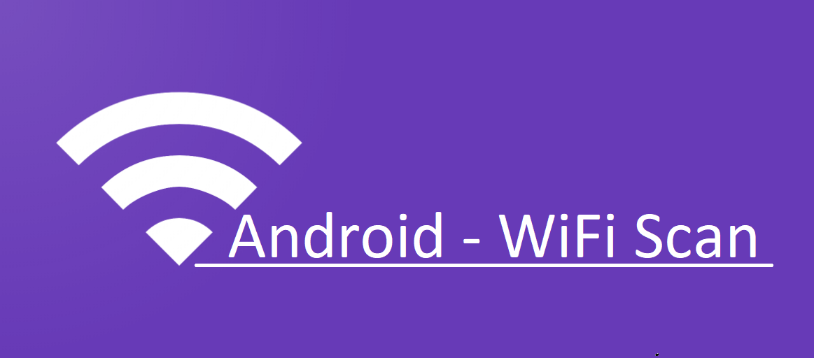

# Android-WifiScan

## Funzionalità

L'applicazione si divide in due parti principali:

* **Scanner**: permette di effettuare la scansione delle reti e salvarle nel database 
* **Database Viewer**: permette di visualizzare e gestire i dati registrati dalle scansioni

### Scanner

Con il bottone SCAN si avvierà la scansione delle reti, è necessario:

* _Aver abilitato i permessi GPS (verranno chiesti comunque all'utente)_
* _Avere il Wifi attivo (verrà abilitato automaticamente)_
* _Avere il GPS attivo (l'applicazione non lo abiliterà in automatico)_

Finita la scansione verrano mostrate a viedeo le reti trovate. 
Tramite l'apposito bottone EDIT sarà possibile modificare la password della rete.

Nel mentre l'applicazione cercerà di prendere la posizione (con alta precisone) del dispositivo. Quando avrà finito il bottone SAVE verrà abilitato.
**Attenzione**: questa operazione impiegherà un po di secondi.

Il bottone SAVE permette di salvare la scansione nel database.

In alto a destra c'è il menù con cui si potrà passare alla visualizzazione del database.

### Database Viewer

Appena aperta questa vista tutti i dati salvati fin ora verranno mostrati a video.

Sarà possibile modificare la password di una rete effettuando un TAP sul campo PASSWORD. 
Per eliminare una rete è sufficente effettuare un TAP prolungato sulla rete.

È anche possibile filtrare le reti per:

* SSID
* Posizione
* SSID e Posizione

**Attenzione**: è richiesta una connessione ad internet funzionante per poter effettuare una ricerca per Posizione. Se non è presente una connessione ad internet funzionante verrà mostrata a video le Coordinate (latitudine e longitudine) invece che la posizione.

La ricerca per posizione offre la funzione **Ricerca precisa** che è possibile attivare anteponendo il carattere `*` alla posizione.

_E.G._ 
`* perugia` oppure `*perugia`

La **Ricerca precisa** mostrerà solo le reti molto vicine alla posizione indicata.

_E.G._ 
Se la stringa di ricerca è `*milano` verranno mostrate solo le reti vicino al centro di mialano e non tutti quelle che si trovano in provincia di Milano o nelle vicinanze di Milano.

Se non si utilizza la funzione **Ricerca precisa** (quindi omettendo il carattere `*`) verranno ordinate le reti in basa alla vicinazna dalla posizione inserita.

Con il menù in alto a destra è possibile esportare l'intero contenuto del database in CSV (verrà salvato nella cartella `Download` del dispositivo) o eliminare tutti i dati.

## Importante

Ricordarsi di inserire una password per l'algoritmo AES modificando la variabile `KEY` nel file `AESCrypt.java` altrimenti la codifica/decodifica non avrà effetto.
